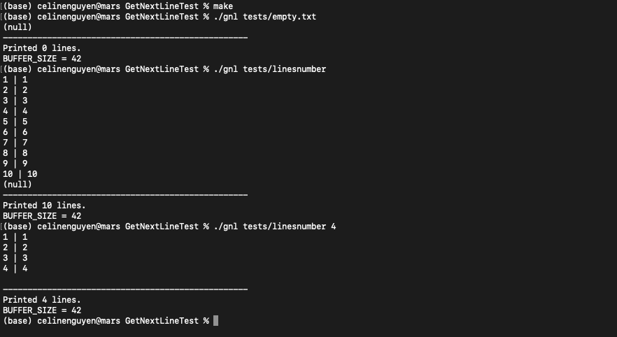

# GetNextLineTest

This is a basic program to test your GetNextLine project. You can run this program that uses your `get_next_line` function to read from the standard input or a text file. Some text files are already provided in the folder `tests`, but you can add and use your own. You can modify the size of your buffer and run `valgrind` on this program.

## Usage

Git clone this repository at the root of the project repository where all the turned-in files must be located. If your file structure is different, modify their path in the Makefile. 

### Mandatory part

Run one of the following :
```bash
make 
make OPTION=-DBUFFER_SIZE=42
```
The second command allows you to customize the buffer size.

Ways you can use the program :
* `./gnl` : read all lines from the standard input
* `./gnl <n>`: read the first `n` lines from the standard input
* `./gnl file.txt` : read all lines from file `file.txt`
* `./gnl file.txt <n>` : read the first `n` lines from file `file.txt`

💡 Hint : Read one line from a file that contains more and run valgrind on this test.

### Bonus part

Run one of the following :
```
make bonus
make bonus OPTION=-DBUFFER_SIZE=42
```
The second command allows you to customize the buffer size.

Ways you can use the program :
* `./gnl` : read all lines from the standard input
* `./gnl file.txt` : read all lines from file `file.txt`
* `./gnl file1.txt file2.txt` : read from files `file1.txt` and `file2.txt` and reading one line from each file at a time alternating the input file. More files can be added.

## Example



## Improvements to-do list

- [ ] The bonus program can read only `n` lines from files without going through the whole file.